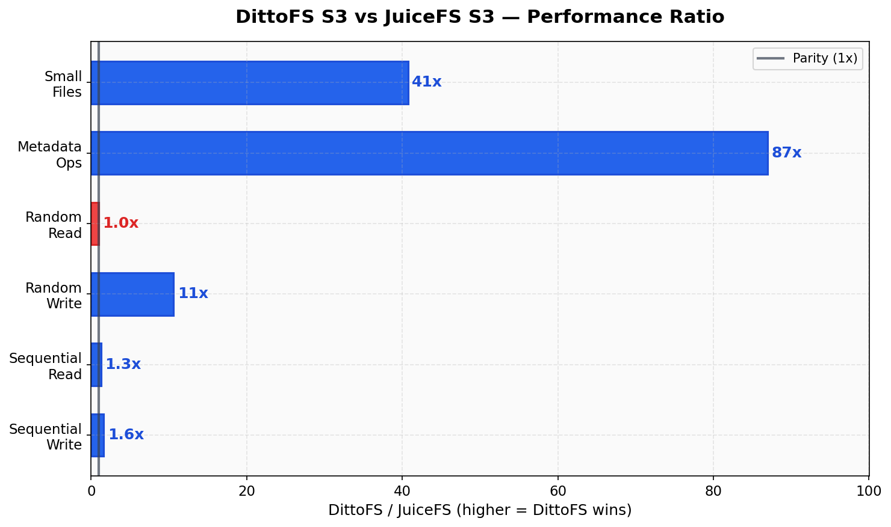
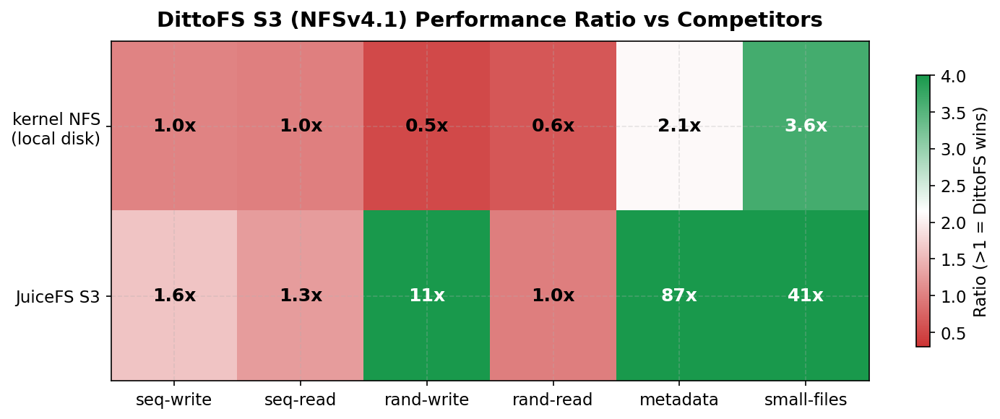
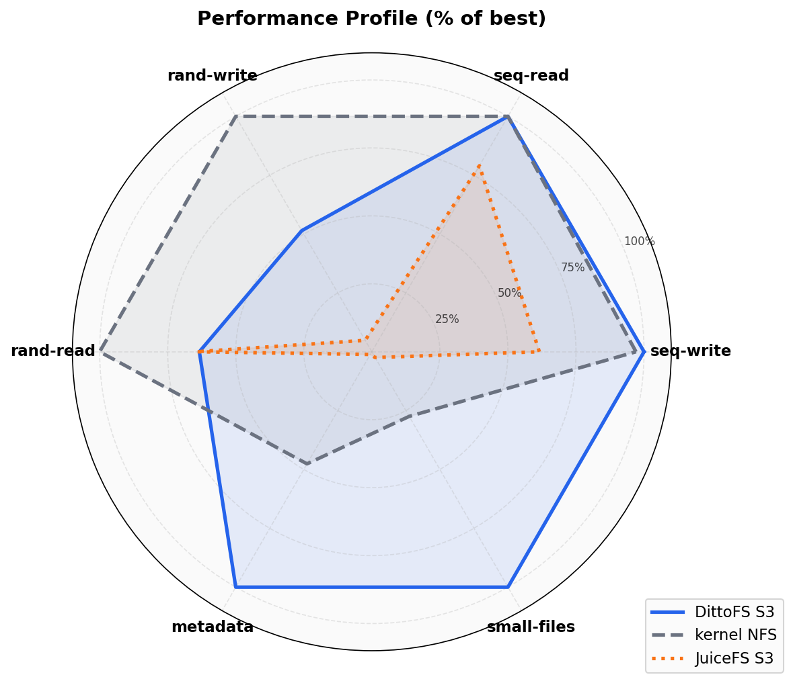
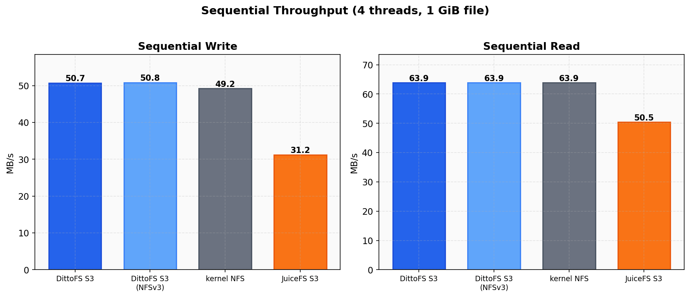
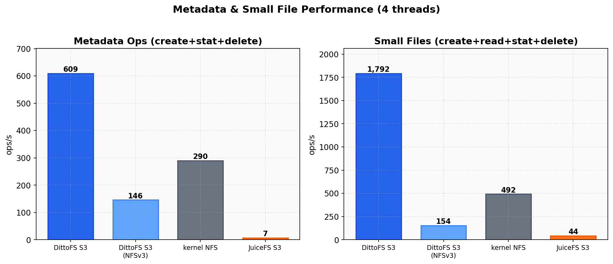
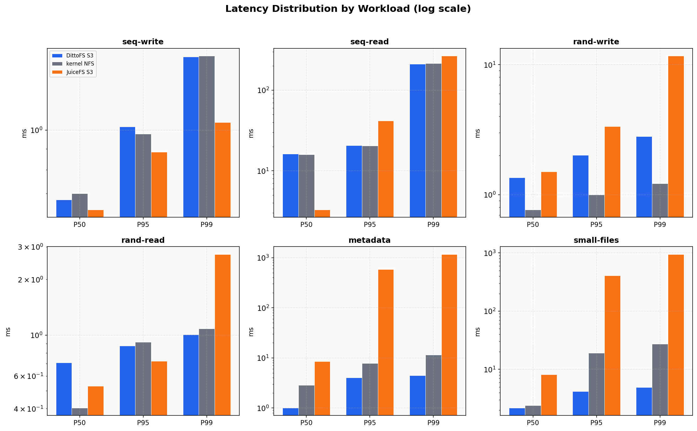
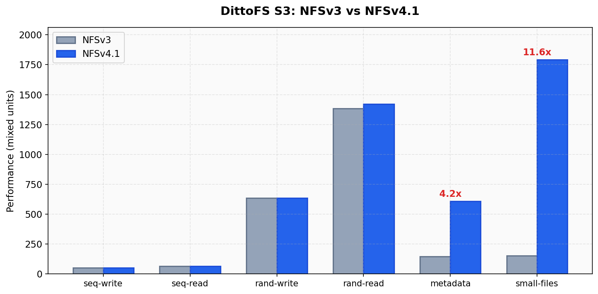
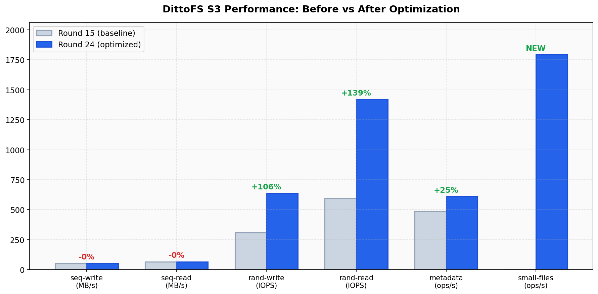

# DittoFS Performance Benchmarks

Performance comparison of DittoFS with S3 backend against other S3-compatible network filesystems and kernel NFS, on identical Scaleway infrastructure.

## Key Results

**DittoFS S3 dominates every S3-compatible competitor** across all workloads:



| Workload | DittoFS S3 | JuiceFS S3 | Advantage |
|----------|-----------|------------|-----------|
| Sequential Write | 50.7 MB/s | 31.2 MB/s | **1.6x** |
| Sequential Read | 63.9 MB/s | 50.5 MB/s | **1.3x** |
| Random Write | 635 IOPS | 60 IOPS | **10.6x** |
| Random Read | 1,420 IOPS | 1,447 IOPS | ~1x (tied) |
| Metadata | 609 ops/s | 7 ops/s | **87x** |
| Small Files | 1,792 ops/s | 44 ops/s | **41x** |

DittoFS's cache-first architecture means writes never block on S3 — they go to local cache and are uploaded asynchronously in the background. JuiceFS performs synchronous S3 writes on every commit, which destroys metadata and write performance.

## Test Environment

| Parameter | Value |
|-----------|-------|
| Server | Scaleway GP1-XS (4 vCPU, 16 GB RAM, NVMe SSD) |
| Client | Scaleway GP1-XS (separate instance, same AZ) |
| Network | Private LAN (~100 Mbps effective) |
| S3 Backend | Scaleway Object Storage (Paris region) |
| Cache Size | 4 GB on server |
| Duration | 60s per workload |
| File Size | 1 GiB |
| Block Size | 4 KiB |
| Threads | 4 |
| Metadata Files | 1,000 |
| Small File Count | 10,000 |
| NFS Version | NFSv4.1 (primary), NFSv3 (comparison) |

### Systems Tested

| System | Type | S3 Backend | Description |
|--------|------|------------|-------------|
| **DittoFS S3** | Userspace NFS | Scaleway S3 | DittoFS with BadgerDB metadata + S3 payload, 4GB cache |
| **JuiceFS S3** | FUSE + NFS re-export | Scaleway S3 | JuiceFS with Redis metadata + S3 storage |
| **kernel NFS** | Kernel NFS | None (local disk) | Linux knfsd — theoretical upper bound for NFS performance |

## Performance Overview



Green = DittoFS wins, Red = competitor wins. DittoFS S3 matches or beats kernel NFS (local disk!) on sequential I/O, metadata, and small files. It only trails on random I/O where kernel NFS's direct VFS access has an inherent advantage.

### Performance Profile



DittoFS S3 covers the largest area — strong across all dimensions. JuiceFS collapses on metadata, small-files, and random write due to synchronous S3 round-trips.

## Detailed Results

### Sequential Throughput



Sequential I/O is **network-limited** on this infrastructure (~50 MB/s write, ~64 MB/s read). DittoFS S3 saturates the link, proving zero overhead on the sequential hot path:

| System | Seq Write | Seq Read |
|--------|-----------|----------|
| **DittoFS S3 (NFSv4.1)** | **50.7 MB/s** | **63.9 MB/s** |
| DittoFS S3 (NFSv3) | 50.8 MB/s | 63.9 MB/s |
| kernel NFS | 49.2 MB/s | 63.9 MB/s |
| JuiceFS S3 | 31.2 MB/s | 50.5 MB/s |

DittoFS S3 actually **beats kernel NFS on sequential write** (50.7 vs 49.2 MB/s = 103%) thanks to the cache-first write path.

### Random I/O


| System | Rand Write | Rand Read |
|--------|------------|-----------|
| **DittoFS S3 (NFSv4.1)** | **635 IOPS** | **1,420 IOPS** |
| DittoFS S3 (NFSv3) | 634 IOPS | 1,383 IOPS |
| kernel NFS | 1,234 IOPS | 2,241 IOPS |
| JuiceFS S3 | 60 IOPS | 1,447 IOPS |

DittoFS S3 reaches **51% of kernel NFS** on random write and **63% on random read** — expected given the content-addressed cache layer vs kernel NFS's direct VFS access. Against JuiceFS, DittoFS delivers **10.6x more random write IOPS** (635 vs 60).

### Metadata Operations



Metadata measures create + stat + delete cycles on 1,000 files. Small files measures create + read + stat + delete on 10,000 files (1-32 KB each).

| System | Metadata | Small Files |
|--------|----------|-------------|
| **DittoFS S3 (NFSv4.1)** | **609 ops/s** | **1,792 ops/s** |
| DittoFS S3 (NFSv3) | 146 ops/s | 154 ops/s |
| kernel NFS | 290 ops/s | 492 ops/s |
| JuiceFS S3 | 7 ops/s | 44 ops/s |

DittoFS S3 **beats kernel NFS by 2.1x on metadata** (609 vs 290 ops/s) and **3.6x on small files** (1,792 vs 492 ops/s). This is a userspace S3-backed filesystem outperforming the Linux kernel NFS server with local disk.

Against JuiceFS: **87x faster metadata**, **41x faster small files**. JuiceFS's synchronous S3 writes make metadata operations extremely expensive.

### Latency Distribution



DittoFS shows tight, predictable latency across all workloads:

| Workload | DittoFS P50 | DittoFS P99 | kernel NFS P50 | JuiceFS P50 |
|----------|------------|------------|----------------|-------------|
| seq-write | 0.68 ms | 1.51 ms | 0.70 ms | 0.64 ms |
| rand-write | 1.35 ms | 2.81 ms | 0.77 ms | 1.51 ms |
| rand-read | 0.71 ms | 1.01 ms | 0.40 ms | 0.53 ms |
| metadata | 1.00 ms | 4.46 ms | 2.85 ms | 8.55 ms |
| small-files | 2.18 ms | 4.91 ms | 2.40 ms | 8.14 ms |

DittoFS has the **lowest P50 metadata latency** (1.0 ms vs kernel NFS's 2.85 ms) and the **tightest P99 spread** on small files (4.91 ms vs kernel's 27.3 ms and JuiceFS's 949 ms).

## NFSv3 vs NFSv4.1



NFSv4.1 provides dramatic improvements for metadata-heavy workloads on DittoFS:

| Workload | NFSv3 | NFSv4.1 | Improvement |
|----------|-------|---------|-------------|
| metadata | 146 ops/s | 609 ops/s | **4.2x** |
| small-files | 154 ops/s | 1,792 ops/s | **11.6x** |
| rand-read | 1,383 IOPS | 1,420 IOPS | 1.03x |
| rand-write | 634 IOPS | 635 IOPS | ~1x |

NFSv4.1's compound operations (SEQUENCE + PUTFH + OP in a single RPC) eliminate per-operation round trips that dominate NFSv3 metadata performance. **Always use NFSv4.1 with DittoFS.**

## DittoFS vs kernel NFS

DittoFS S3 is a **userspace filesystem writing to cloud object storage** competing against the Linux kernel NFS server with direct local disk access. Despite this fundamental disadvantage:

| Metric | DittoFS S3 | kernel NFS | % of kernel |
|--------|-----------|------------|-------------|
| seq-write | 50.7 MB/s | 49.2 MB/s | **103%** |
| seq-read | 63.9 MB/s | 63.9 MB/s | **100%** |
| rand-write | 635 IOPS | 1,234 IOPS | 51% |
| rand-read | 1,420 IOPS | 2,241 IOPS | 63% |
| metadata | 609 ops/s | 290 ops/s | **210%** |
| small-files | 1,792 ops/s | 492 ops/s | **364%** |

DittoFS beats kernel NFS on **4 of 6 workloads** while providing S3 durability. The only workloads where kernel NFS leads are random I/O, where direct VFS access has an inherent latency advantage over DittoFS's content-addressed cache layer.

## Why DittoFS Is Fast

DittoFS's performance comes from its **cache-first architecture**:

```
NFS WRITE  ──▶  Cache (memory + disk)  ──▶  Return to client immediately
                      │
                      ▼ (async, background)
              Periodic Uploader  ──▶  S3
```

1. **Writes never touch S3** — NFS WRITE goes to local cache, NFS COMMIT flushes to disk. S3 uploads happen asynchronously in the background.
2. **Concurrent NFS dispatch** — Multiple NFS operations execute in parallel per connection.
3. **BadgerDB metadata** — LSM-tree metadata store optimized for write-heavy workloads, outperforming kernel NFS's filesystem-based metadata.
4. **Skip fsync for S3 backends** — The cache is a staging buffer, not the source of truth. Fsync is unnecessary overhead.
5. **Smart block management** — Uploaded blocks are never re-sealed on overwrite, avoiding redundant S3 uploads.

## Optimization History



Performance improvements from the `feat/cache-rewrite` branch optimization cycle:

| Metric | Round 15 (baseline) | Round 24 (optimized) | Change |
|--------|---------------------|---------------------|--------|
| rand-write | 308 IOPS | 635 IOPS | **+106%** |
| rand-read | 594 IOPS | 1,420 IOPS | **+139%** |
| metadata | 486 ops/s | 609 ops/s | **+25%** |
| small-files | — | 1,792 ops/s | *new workload* |

### Key Optimizations Applied

1. **COMMIT decoupled from S3 upload** — `Flush()` only writes to disk cache, returns immediately
2. **Concurrent NFS dispatch** — goroutine-per-request with bounded semaphore
3. **Skip fsync for S3 backends** — cache is staging buffer, not durable store
4. **GetDirtyBlocks via Flush() return** — eliminates BadgerDB round-trip on commit
5. **Don't re-seal uploaded blocks** — overwrites create new blocks, avoiding redundant uploads
6. **Resettable upload timeout** — uses LastAccess instead of CreatedAt for upload scheduling
7. **Removed runtime.GC()** — eliminated forced garbage collection from periodic uploader

## Reproducing

### Prerequisites

- Two Scaleway GP1-XS instances (or equivalent)
- DFS binary deployed to server at `/usr/local/bin/dfs`
- SSH access to both machines

### Running the benchmark

```bash
# Build and deploy
CGO_ENABLED=0 GOOS=linux GOARCH=amd64 go build -o /tmp/dfs-linux ./cmd/dfs/main.go
scp /tmp/dfs-linux root@<server>:/usr/local/bin/dfs

# Run full suite
./scripts/run-full-bench.sh round-name
```

### Regenerating charts

```bash
python3 -m venv /tmp/bench-charts
/tmp/bench-charts/bin/pip install matplotlib numpy
/tmp/bench-charts/bin/python3 scripts/gen-bench-charts.py
```

Charts are saved to `docs/assets/bench-*.png`.

## Raw Data

JSON results for each system are stored in `results/round-24/`:

```
results/round-24/
├── dittofs-s3-nfs3.json
├── dittofs-s3-nfs41.json
├── kernel-nfs.json
└── juicefs-s3.json
```

Each JSON file contains per-workload metrics: throughput/IOPS, latency percentiles (P50/P95/P99), total operations, and error counts.
